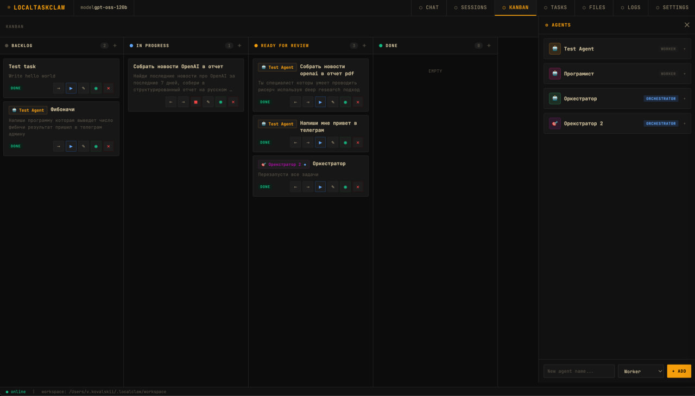

# LocalTaskClaw

Personal AI agent with Telegram bot, admin UI, and kanban board for multi-agent task management.




## Install

```bash
curl -fsSL https://raw.githubusercontent.com/vakovalskii/LocalTaskClaw/main/install.sh | bash
```

## What you get

- **Telegram bot** — stream replies, live typing preview
- **Admin UI** — chat, sessions, kanban, tasks, files, logs, settings
- **Kanban board** — 5-column board (Backlog → In Progress → Review → Done / Needs Human), up to 10 agents with custom identities and roles
- **Orchestrator/Worker model** — orchestrator agents dispatch workers via `kanban_run`, read artifacts via `kanban_read_result`, verify results via `kanban_verify`, send reports via `kanban_report`
- **Auto-retry** — rejected tasks retry up to 2 times, then escalate to Needs Human
- **Repeat/heartbeat** — tasks with `repeat_minutes > 0` auto-rerun on a schedule
- **Parallel tool calls** — agents run multiple tools concurrently via `asyncio.gather`
- **Any OpenAI-compatible model** — local (Ollama) or cloud
- **Web search** via Brave
- **Real token streaming** — both in UI and Telegram
- **Three isolation modes** — Docker (recommended), native processes, or restricted to agent folder

## Requirements

- Linux server (Ubuntu/Debian/CentOS)
- Docker + Docker Compose
- Telegram Bot Token (from @BotFather)
- OpenAI-compatible model endpoint

## Architecture

Containers:

| Container | Role |
|-----------|------|
| `core` | Python ReAct agent + FastAPI + SQLite |
| `bot` | Telegram bot |
| `traefik` | HTTPS reverse proxy (optional, with domain) |

## Status

Work in progress. See [PLAN.md](PLAN.md) for roadmap.
